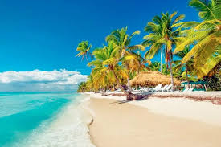

# Bienvenido a República Dominicana

República Dominicana es uno de los destinos turísticos más completos y vibrantes del Caribe.
Con playas paradisíacas, rica cultura, música única y una gastronomía inolvidable, este país ofrece experiencias para todo tipo de viajeros.

## ¿Por qué visitar República Dominicana?

### 🌴 Playas paradisíacas
Kilómetros de arena blanca y aguas turquesa en lugares como:
- Punta Cana
- Playa Rincón
- Bahía de las Águilas

### 🏞 Naturaleza y aventura
Explora montañas, ríos, cascadas y parques nacionales:
- Pico Duarte
- Salto El Limón
- Los Haitises

### 🏙 Cultura e historia
La Zona Colonial de Santo Domingo es Patrimonio de la Humanidad por la UNESCO.

### 🍽 Gastronomía única
Platos emblemáticos:
- La Bandera
- Mangú
- Sancocho

---
