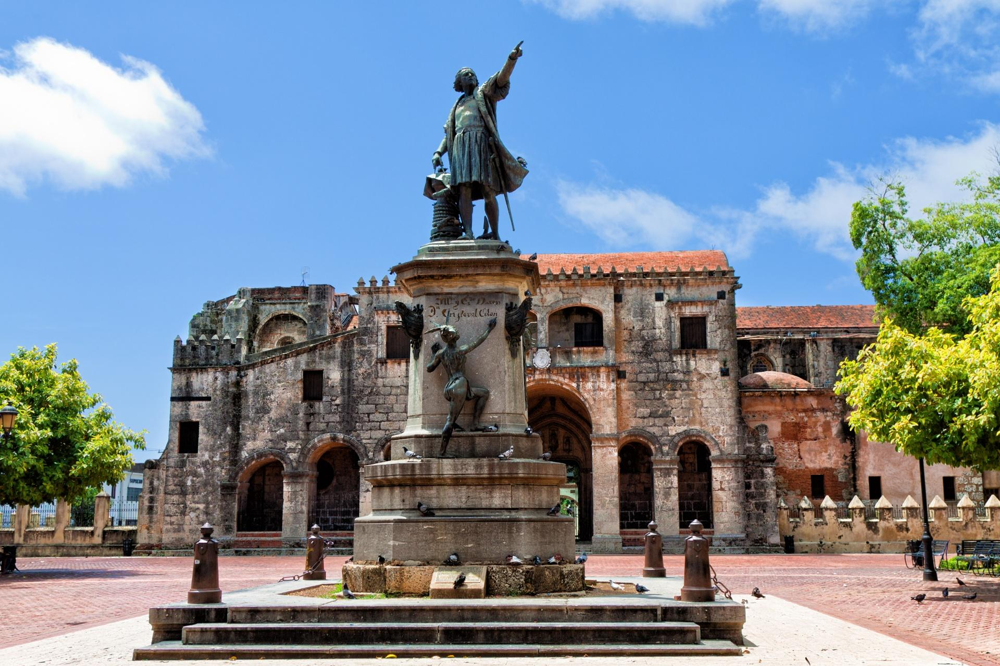

# Qué visitar en República Dominicana

República Dominicana ofrece algunos de los destinos más bellos y representativos del Caribe. Aquí te presentamos **tres lugares esenciales** que no puedes dejar pasar.

---

## 🏙 Zona Colonial – Santo Domingo
El corazón histórico del país, declarado Patrimonio de la Humanidad por la UNESCO. Ideal para caminar entre calles coloniales, monumentos y museos.

---

## 🏖 Punta Cana
Famosa por sus playas de arena blanca y aguas cristalinas. Es el destino perfecto para relajarse y disfrutar de actividades acuáticas.

---

## 🌿 Samaná
Una región natural impresionante que destaca por sus paisajes tropicales y el famoso **Salto El Limón**.

---
